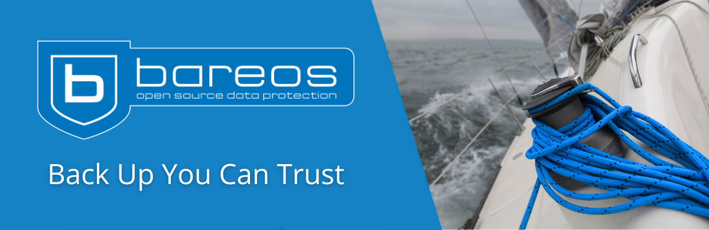

    <!-- Image on top -->
    
  <!-- Supported Systems row below -->
    

       

    

    <!-- Badges below -->
    

        
      
        
    

 

[**Bareos**](https://www.bareos.com) is a reliable, cross-network open-source backup solution for data protection, archiving, and recovery. It supports Linux, Windows, FreeBSD, macOS, and other well-established operating systems. Bareos offers scalable, enterprise-grade features for businesses of all sizes, ensuring secure and efficient data management.

---

### Key Features

- **True Open Source**: Licensed under AGPLv3 with no open-core or restrictions.
- **Cross-Platform**: Supports Linux, Windows, FreeBSD, macOS, and more.
- **Scalable Architecture**: Designed for many clients and storage targets across networks.
- **Multiple Backends**: Supports disk, tape, dedupable and cloud/object storage to store backups.
- **Plugins for Modern Workloads**: Built-in and optional plugins for databases, virtualization, Linux and Windows bare-metal recovery and more.
- **Virtualization Backups**: Support for hypervisors such as VMware vSphere, Proxmox, Hyper-V (depending on version/subscription).
- **NDMP SAN Backups**: High-speed SAN backups using NDMP with DAR/DDAR support.
- **Incremental and Full Backups**: Supports full, incremental, differential, always incremental and virtual full workflows (as configured).
- **Encryption**: Secure backups with built-in encryption.
- **Automation-Friendly**: Scriptable via CLI and integrates well into automation pipelines.
- GUI based administration via Bareos WebUI
- CLI based administration via bconsole
- **Role-Based ACL**: Secure access control with role-based permissions.

---

### Releases

### Documentation

### Join Our Community

### Social Media

[-Follow%20Us-1DA1F2?logo=twitter)](https://twitter.com/bareos_backup)

## Join the Bareos Team

Are you a developer passionate about open-source technology? We’re always open to collaborating with skilled professionals, whether freelance or employed, ideally based in Germany or the EU. Reach out to us at jobs@bareos.com or join the discussion on our [GitHub Discussions page](https://github.com/bareos/bareos/discussions).

---

## Videos

  <a href="https://www.youtube.com/playlist?list=PLo4hatlfsTzQkRYkzHmdhyoPx1Q9PXBEL">
    Watch Bareos videos on YouTube
  </a>

---

## What's New

Bareos 25 brings new plugins and platform improvements - from extended hypervisor support to Windows bare-metal recovery and improved automation.

### Bareos 25 Plugins and Features
- **Hyper-V Plugin**: Adds native support for Microsoft Hyper-V. The plugin can back up and restore virtual machines and uses Resilient Change Tracking (RCT) for very fast incremental backups. Full and incremental backups are supported, and restore recreates the VM and its disks in Hyper-V.
- **Proxmox Plugin**: Agentless backups for Proxmox Virtual Environment guests. After installing the Bareos File Daemon with the plugin on one cluster node, Bareos can back up both virtual machines and container guests. The plugin currently supports full backups. Restore can recreate a guest on the cluster or restore into a local `.vma` dump file for import via the Proxmox GUI.
- **Barri Plugin (Windows Disaster Recovery)**: The new Bareos Recovery Imager (Barri) plugin provides a toolset for creating and restoring Windows disaster recovery images. It can generate a full recovery image of a running Windows system without downtime, via the File Daemon plugin or `barri-cli.exe`. Recovery can be done through a Linux live environment, via Linux/Windows CLI tools, or inside a Windows PE environment when drivers are required. Supports connected and fully offline workflows.
- **Libcloud Plugin**: Re-adds support for backing up cloud objects stored via the S3 protocol through the Apache Libcloud plugin. The plugin can recurse nested buckets and back up objects. Updated for current Python versions and uses the standard `threading` module. Restores write objects to a local filesystem (not directly back to S3).
- **Qumulo Plugin (Third-party, by Yuzuy)**: Integrates Qumulo clusters with the Bareos File Daemon. Supports full and incremental backups, snapshot-based backups, ACL handling, exclusions, fast scan for changed data (avoids expensive tree walks), and virtual full backups.
- **New Regular Expression Library**: Switches from the legacy regex library to the faster PCRE2 engine on Windows. Depending on the pattern and complexity, expected speedup is between 2× and 20×.
- **Automatic Configuration of Disk Autochanger**: For disk devices configured with `Count > 1`, Bareos now creates required virtual devices automatically and groups them into an autochanger, avoiding manual setup. The remaining manual step is setting an appropriate `Maximum Concurrent Jobs` value in the Director.

<a href="https://docs.bareos.org/master/Appendix/ReleaseNotes.html" target="_blank" rel="noopener noreferrer">See Release Notes & Changelog</a>
