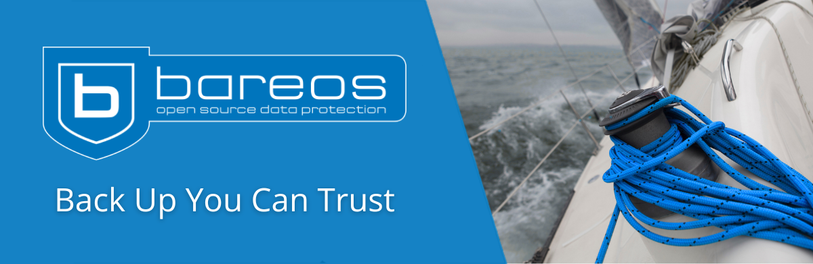

# 

   

       

    

    <!-- Badges below -->
    

        
      
        
    

 

[Bareos](https://www.bareos.com) is backup and recovery open-source software for mixed IT environments.

Bareos helps organizations back up, restore and manage data across networks, operating systems, storage targets and workloads. It is licensed under AGPLv3 and follows a true open-source approach without open-core restrictions.

Bareos supports Linux, Windows, FreeBSD, macOS and other well-established operating systems.

---

### Key Features

- **Open and transparent**: Licensed under AGPLv3, with no open-core restrictions.
- **Cross-platform**: Supports Linux, Windows, FreeBSD, macOS and other operating systems.
- **Scalable architecture**: Designed for many clients, storage daemons and backup targets across networks.
- **Flexible storage targets**: Store backups on disk, tape and S3-compatible object storage.
- **Deduplication-friendly storage**: Stores backups in a format optimized for deduplicating storage systems such as ZFS, VDO or btrfs.
- **Storage planning**: `bdedupestimate` helps estimate deduplication potential before changing the backup setup.
- **Always Incremental backups**: Supports an Always Incremental backup scheme for file-based backups.
- **Controlled restore**: Uses a catalog and WebUI to help teams find, select and restore the right data.
- **Access control**: Role-based ACL support for commands and objects.
- **Encryption**: Supports encrypted communication and backup encryption.
- **Automation-friendly**: Scriptable administration through `bconsole` and command-line tools.
- **Web-based administration**: Bareos WebUI provides a graphical interface for administration and restore tasks.
- **Extensible plugins**: Plugins allow Bareos to support virtual environments, databases and specialized workloads.
- **Virtualization support**: Plugins are available for workloads such as VMware vSphere, Hyper-V and Proxmox.
- **Bare-metal recovery**: Supports Linux bare-metal recovery with Relax-and-Recover and Windows disaster recovery with `Barri`.
- **NDMP SAN backups**: Supports SAN backups using NDMP with DAR/DDAR.
- **Tape support**: Supports tape, tape libraries and WORM tape media for long-term retention workflows.
- **Just-In-Time Device Reservation**: Improves storage device usage in environments with shared devices, tape libraries, autochangers or parallel backup jobs.

---

### Releases

### Documentation

### Join Our Community

### Social Media

[-Follow%20Us-1DA1F2?logo=twitter)](https://twitter.com/bareos_backup)

### Commercial Services

Bareos offers commercial services for organizations using Bareos in production environments.

- Subscription repositories
- Professional support
- Consulting
- Training
- Sponsored development

[Learn more about Bareos services](https://www.bareos.com/services/)

---
## Join the Bareos Team

Are you a developer passionate about open-source technology? We’re always open to collaborating with skilled professionals, whether freelance or employed, ideally based in Germany or the EU. Reach out to us at jobs@bareos.com or join the discussion on our [GitHub Discussions page](https://github.com/bareos/bareos/discussions).

### Videos

[Watch Bareos videos on YouTube](https://www.youtube.com/playlist?list=PLo4hatlfsTzQkRYkzHmdhyoPx1Q9PXBEL)

---
### What's New

Bareos 25 adds new plugins and platform improvements, including extended hypervisor support, Windows disaster recovery workflows, cloud object backup support and improved automation.

Recent additions include:

- Hyper-V Plugin for Microsoft Hyper-V backups
- Proxmox Plugin for Proxmox VE guests
- Bareos Recovery Imager for Windows disaster recovery workflows
- Libcloud Plugin for S3-compatible object backup
- Qumulo Plugin for Qumulo cluster backups
- PCRE2 support for faster regular expression handling on Windows
- Automatic configuration of disk autochangers

For details, see the official release notes:

[View Bareos Release Notes](https://docs.bareos.org/master/Appendix/ReleaseNotes.html)

### Latest Release Information

For current release information, new features and maintenance updates, please see the official release notes:

[View Bareos Release Notes](https://docs.bareos.org/master/Appendix/ReleaseNotes.html)
