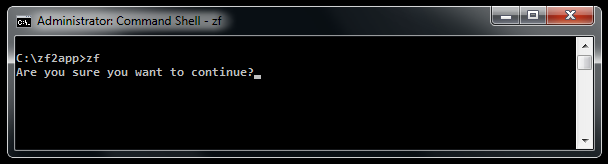
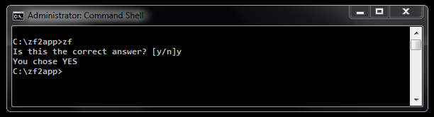
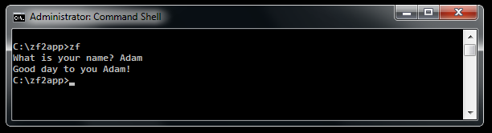
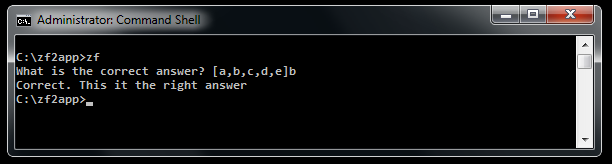
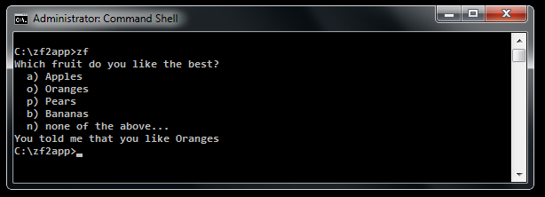
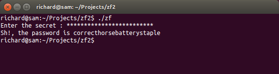

# Console prompts

In addition to the console abstraction layer, zend-console provides numerous
convenience classes for interacting with the user in a console environment. This
chapter describes available `Zend\Console\Prompt` classes and their usage.

All prompts can be instantiated directly, and expose a `show()` method.

```php
use Zend\Console\Prompt;

$confirm = new Prompt\Confirm('Are you sure you want to continue?');
$result = $confirm->show();
if ($result) {
    // the user chose to continue
}
```

You can also use prompts statically, via the static `prompt()` method:

```php
use Zend\Console\Prompt;

$result = Prompt\Confirm::prompt('Are you sure you want to continue?');
if ($result) {
    // the user chose to continue
}
```

Both of above examples will display something like this:



## Confirm

This prompt is best used for **yes** / **no** prompts.

```php
Confirm(string $text, string $yesChar = 'y', string $noChar = 'n') : bool
```

Argument | Description
-------- | -----------
`$text` | (string) The text to show with the prompt.
`$yesChar` | (string) The character that corresponds with the YES choice. (default is `y`)
`$noChar` | (string) The character that corresponds with the NO choice. (default is `n`)

Example usage:

```php
use Zend\Console\Prompt\Confirm;

if ( Confirm::prompt('Is this the correct answer? [y/n]', 'y', 'n')) {
    $console->write("You chose YES");
} else {
    $console->write("You chose NO");
}
```



## Line

This prompt asks for a line of text input.

```php
Line(
    string $text = 'Please enter value',
    bool $allowEmpty = false,
    bool $maxLength = 2048
) : string
```

Argument | Description
-------- | -----------
`$text` | (string) The text to show with the prompt.
`$allowEmpty` | (boolean) Can this prompt be skipped, by pressing `[ENTER]`?  (default is false)
`$maxLength` | (integer) Maximum length of the input. Anything above this limit will be truncated.

Example usage:

```php
use Zend\Console\Prompt\Line;

$name = Line::prompt(
    'What is your name?',
    false,
    100
);

$console->write("Good day to you $name!");
```



## Char

This prompt reads a single keystroke, and optionally validates it against a list
of allowed characters.

```php
Char(
    string $text = 'Please hit a key',
    string $allowedChars = 'abc',
    bool $ignoreCase = true,
    bool $allowEmpty = false,
    bool $echo = true
) : string
```

Argument | Description
-------- | -----------
`$text` | (string) The text to show with the prompt.
`$allowedChars` | (string) A list of allowed keys that can be pressed.
`$ignoreCase` | (boolean) Ignore the case of chars pressed (default is true).
`$allowEmpty` | (boolean) Can this prompt be skipped, by pressing `[ENTER]`?  (default is false)
`$echo` | (boolean) Should the selection be displayed on the screen?

Example usage:

```php
use Zend\Console\Prompt\Char;

$answer = Char::prompt(
    'What is the correct answer? [a,b,c,d,e]',
    'abcde',
    true,
    false,
    true
);

if ($answer == 'b') {
    $console->write('Correct. This is the right answer.');
} else {
    $console->write('Wrong! Try again.');
}
```



## Select

This prompt displays a number of choices, and asks the user to pick one.

```php
Select(
    string $text = 'Please select one option',
    array $options = [],
    bool $allowEmpty = false,
    bool $echo = false
) : string
```

Argument | Description
-------- | -----------
`$text` | (string) The text to show with the prompt.
`$options` | (array) An associative array with keys strokes (chars) and their displayed values.
`$allowEmpty` | (boolean) Can this prompt be skipped, by pressing `[ENTER]`?  (default is false)
`$echo` | (boolean) Should the selection be displayed on the screen?

Example usage:

```php
$options = [
    'a' => 'Apples',
    'o' => 'Oranges',
    'p' => 'Pears',
    'b' => 'Bananas',
    'n' => 'none of the above...',
];

$answer = Select::prompt(
    'Which fruit do you like the best?',
    $options,
    false,
    false
);

$console->write("You told me that you like " . $options[$answer]);
```



## Password

This prompt reads in a string, without echoing that string back to the console;
the most common use case is password prompts, which gives it its name.

```php
Password(
    string $promptText = 'Password : ',
    boolean $echo = true
) : string
```

Argument | Description
-------- | -----------
`$promptText` | (string) The text to show with the prompt.
`$echo` | (bool) Display `*` in place of each character typed. Can be skipped.  (default is `true`)

Example usage:

```php
use Zend\Console\Prompt\Password;

$password = Password::prompt('Enter the secret', true);

$console->write("Sh!, the password is $password");
```


